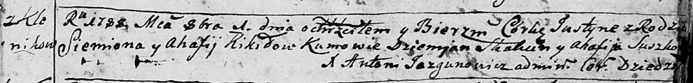

**Кикило Семён (Kikiło Siemion)**

1 октября 1788 г -- крещение дочери Юстыны (НИАБ 136-13-894, лист 5,
№51/1788-р (ориг)), (РГИА 823-2-18, лист 236об, №28/1788-р (коп)).

**НИАБ 136-13-894:** Лист 5. **Метрическая запись №51/1788-р (ориг).**

Дедиловичская Покровская церковь. 1 октября 1788 года. Метрическая
запись о крещении.

Kikiłowna Justyna -- дочь родителей с деревни Клинники.

Kikiło Siemion -- отец.

Kikiłowa Ahafija -- мать.

Skakun Dziemjan - кум.

Suszkowa Ahafija - кума.

Jazgunowicz Antoni -- ксёндз.

**РГИА 823-2-18:** Лист 237. **Метрическая запись №28/1788-р (коп).**

Дедиловичская Покровская церковь. 1 октября 1788 года. Метрическая
запись о крещении.

Kikiłowna Justyna -- дочь родителей с деревни Клинники.

Kikiło Siemion -- отец.

Kikiłowa Ahafija -- мать.

Skakun Dziemian -- кум.

Suszkowa Ahafija - кума.

Jazgunowicz Antoni -- ксёндз.
