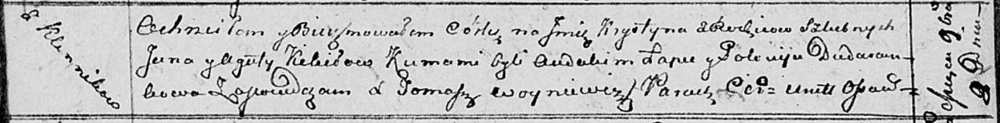

**Кикило Крыстына Янова (Kikiłowna Krystyna)**

8 ноября 1813 г -- крещение (НИАБ 136-13-894, лист 87об, №34/1813-р
(ориг)).

**НИАБ 136-13-894:** Лист 87об. **Метрическая запись №34/1813-р
(ориг).**

Осовская Покровская церковь. 8 ноября 1813 года. Метрическая запись о
крещении.

Kikiłowna Krystyna -- дочь родителей с деревни Клинники.

Kikiło Jan -- отец.

Kikiłowa Agata -- мать.

Łapeć Audakim -- кум.

Dudaronkowa Połonija -- кума.

Woyniewicz Tomasz -- ксёндз.
