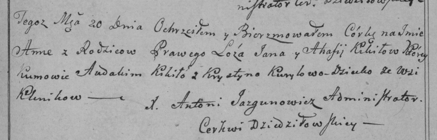
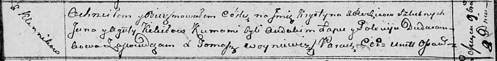

**Кикило Ян (Kikiło Jan)**

20 июля 1799 г -- крещение дочери Анны Барбары (НИАБ 136-13-894, лист
29, №32/1799-р (ориг), РГИА 823-2-18, лист 271, №31/1799-р (коп), НИАБ
136-13-938, лист 243, №30/1799-р коп)).

18 марта 1802 г -- возможно, крестный отец Якуба? Марка, сына Сушков
Алексея и Евдокии с деревни Клинники (НИАБ 136-13-894, лист 46,
№12/1802-р (ориг)).

8 ноября 1813 г -- крещение дочери Крыстыны (НИАБ 136-13-894, лист 87об,
№34/1813-р (ориг)).

10 апреля 1818 г -- крещение дочери Марьи (НИАБ 136-13-894, лист 98,
№13/1818-р (ориг)).

**НИАБ 136-13-894:** Лист 39. **Метрическая запись №32/1799-р (ориг).**

Дедиловичская Покровская церковь. 20 июля 1799 года. Метрическая запись
о крещении.

Kikiłowna Anna Barbara -- дочь родителей с деревни Клинники.

Kikiło Jan -- отец.

Kikiłowa Ahafija -- мать.

Kikiło Awdakim -- кум.

Kuryłowa Krystyna -- кума.

Jazgunowicz Antoni -- ксёндз.

**РГИА 823-2-18:** Лист 271. **Метрическая запись №31/1799-р (коп).**

Дедиловичская Покровская церковь. 20 августа 1799 года. Метрическая
запись о крещении.

Kikiłowna Anna -- дочь родителей с деревни Клинники.

Kikiło Jan -- отец.

Kikiłowa Ahafija -- мать.

Kikiło Audakim -- кум.

Kuryłowa Krystyna -- кума.

Jazgunowicz Antoni -- ксёндз.

**НИАБ 136-13-938:** Лист 243. **Метрическая запись №30/1799-р (коп).**

(См. тж. НИАБ 136-13-894, лист 39, №32/1799-р (ориг); РГИА 823-2-18,
лист 271, №31/1799-р (коп))

Дедиловичская Покровская церковь. 20 августа 1799 года. Метрическая
запись о крещении.

Kikiłowna Anna Barbara -- дочь родителей с деревни Клинники.

Kikiło Jan -- отец.

Kikiłowa Ahafija -- мать.

Kikiło Awdakim -- кум, с деревни Клинники.

Kuryłowa Krystyna - кума, с деревни Клинники.

Jazgunowicz Antoni -- ксёндз.

**НИАБ 136-13-894:** Лист 46. **Метрическая запись №12/1802-р (ориг).**

Дедиловичская Покровская церковь. 18 марта 1802 года. Метрическая запись
о крещении.

Suszko Jakub? Markо -- сын родителей с деревни Клинники.

Suszko Alexiеy -- отец.

Suszkowa Ewdokija -- мать.

Kikiło Jan -- кум, с деревни Клинники.

Randakowa Daryia -- кума, с деревни Клинники.

Jazgunowicz Antoni -- ксёндз.

**НИАБ 136-13-894:** Лист 87об. **Метрическая запись №34/1813-р
(ориг).**

Осовская Покровская церковь. 8 ноября 1813 года. Метрическая запись о
крещении.

Kikiłowna Krystyna -- дочь родителей с деревни Клинники.

Kikiło Jan -- отец.

Kikiłowa Agata -- мать.

Łapeć Audakim -- кум.

Dudaronkowa Połonija -- кума.

Woyniewicz Tomasz -- ксёндз.

**НИАБ 136-13-894:** Лист 98. **Метрическая запись №13/1818-р (ориг).**

Осовская Покровская церковь. 10 апреля 1818 года. Метрическая запись о
крещении.

Kikiłowna Marja -- дочь родителей с деревни Клинники.

Kikiło Jan -- отец.

Kikiłowa Ahafija -- мать.

Łapieć Audakim -- кум.

Dudaronkowa Połonia -- кума.

Woyniewicz Tomasz -- ксёндз.
