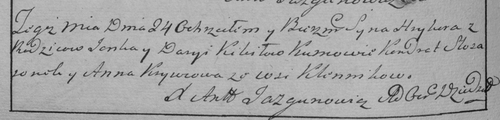

**Кикило Грыгор Янков (Kikiło Hryhor)**

24 января 1786 г -- крещение (РГИА 823-2-18, лист 230об, №3/1786-р
(коп)).

**НИАБ 823-2-18:** Лист 230об. **Метрическая запись №3/1786-р (коп).**

Дедиловичская Покровская церковь. 24 января 1786 года. Метрическая
запись о крещении.

Kikiło Hryhor -- сын родителей с деревни Клинники.

Kikiło Janka -- отец.

Kikiłowa Darya -- мать.

Słosaronok Kondrat -- кум.

Krywcowa Anna - кума.

Jazgunowicz Antoni -- ксёндз.
