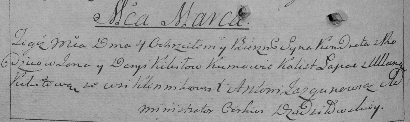

**Кикило Кондрат Янков (Kikiło Kondrat)**

4 марта 1795 г -- крещение (НИАБ 136-13-894, лист 24, №4/1795-р (ориг)),
(РГИА 823-2-18, лист 251об, №4/1795-р (коп)).

**НИАБ 136-13-894:** Лист 24. **Метрическая запись №4/1795-р (ориг).**

{width="6.496527777777778in"
height="0.7784569116360455in"}

Дедиловичская Покровская церковь. 4 марта 1795 года. Метрическая запись
о крещении.

Kikiło Kondrat -- сын родителей с деревни Клинники.

Kikiło Jan -- отец.

Kikiłowa Daryia -- мать.

Łapac Kalist - кум.

Kikiłowa Ullana - кума.

Jazgunowicz Antoni -- ксёндз.

**РГИА 823-2-18:** Лист 251об. **Метрическая запись №4/1795-р (коп).**

{width="6.496527777777778in"
height="1.9354166666666666in"}

Дедиловичская Покровская церковь. 4 марта 1795 года. Метрическая запись
о крещении.

Kikiło Kondrat -- сын родителей с деревни Клинники.

Kikiło Jan -- отец.

Kikiłowa Darya -- мать.

Łapac Kalist -- кум.

Kikiłowa Ullana -- кума.

Jazgunowicz Antoni -- ксёндз.
