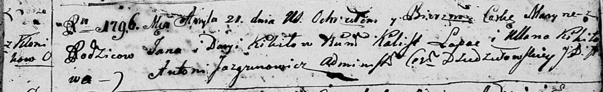

**Кикило Марына Янкова (Kikiłowna Maryna)**

21 апреля 1796 г -- крещение (НИАБ 136-13-894, лист 29, №47/1796-р
(ориг)).

**НИАБ 136-13-894:** Лист 29. **Метрическая запись №47/1796-р (ориг).**

{width="6.496527777777778in"
height="1.0017355643044619in"}

Дедиловичская Покровская церковь. 21 апреля 1796 года. Метрическая
запись о крещении.

Kikiłowna Maryna -- дочь родителей с деревни Клинники.

Kikiło Jan -- отец.

Kikiłowa Daryia -- мать.

Łapać Kalist - кум.

Kikiłowa Ullana - кума.

Jazgunowicz Antoni -- ксёндз.
