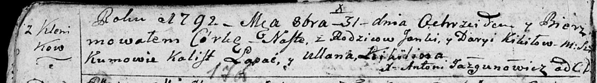

**Кикило Наста Янкова (Kikiłowa Nasta)**

31 октября 1792 г -- крещение (НИАБ 136-13-894, лист 17об, №70/1792-р
(ориг)).

Лист 17-об. **Метрическая запись №70/1792-р (ориг).**

Дедиловичская Покровская церковь. 31 октября 1792 года. Метрическая
запись о крещении.

Kikiłowna Nasta -- дочь родителей с деревни Клинники.

Kikiło Janka -- отец.

Kikiłowa Daryia -- мать.

Łapać Kalist - кум.

Kikiłowa Ullana - кума.

Jazgunowicz Antoni -- ксёндз.
