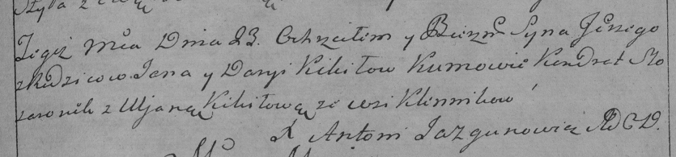

**Кикило Сергей Янков (Kikiło Jerzy)**

23 апреля 1789 г -- крещение (НИАБ 136-13-894, лист 7, №25/1789-р
(ориг)), (РГИА 823-2-18, лист 238, №10/1789-р (коп)).

**НИАБ 136-13-894:** Лист 7. **Метрическая запись №25/1789-р (ориг).**

{width="6.496527777777778in"
height="0.8636111111111111in"}

Дедиловичская Покровская церковь. 23 апреля 1789 года. Метрическая
запись о крещении.

Kikiło Jerzy -- сын родителей с деревни Клинники .

Kikiło Jan -- отец.

Kikiłowa Daryia -- мать.

Slosaronek Kondrat - кум.

Kikilo ..na - кума.

Jazgunowicz Antoni -- ксёндз.

**РГИА 823-2-18:** Лист 238. **Метрическая запись №11/1789-р (коп).**

{width="6.496527777777778in"
height="1.5173611111111112in"}

Дедиловичская Покровская церковь. 23 апреля 1789 года. Метрическая
запись о крещении.

Kikiło Jerzy -- сын родителей с деревни Клинники.

Kikiło Jan -- отец.

Kikiłowa Darya -- мать.

Słosaronek Kondrat -- кум.

Kikiłowa Uljana - кума.

Jazgunowicz Antoni -- ксёндз.
