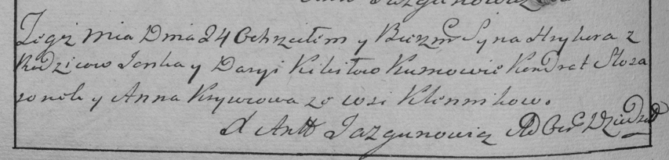
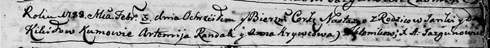
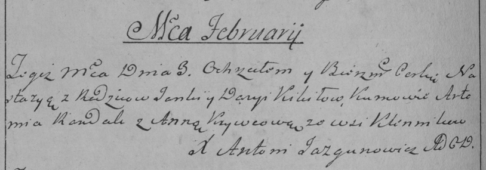
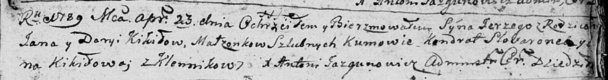
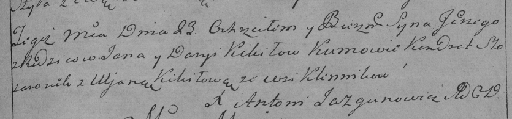
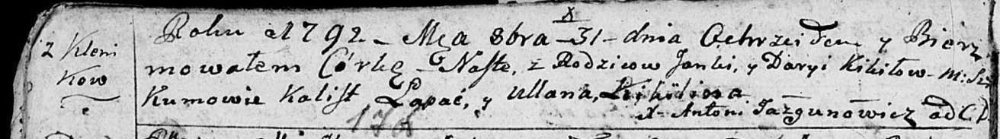
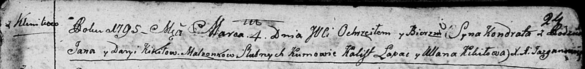
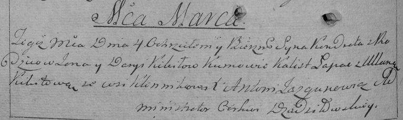
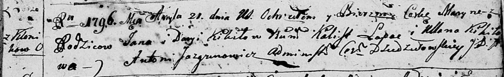

**Кикило Янка (Kikiło Janka, Jan)**

24 января 1786 г -- крещение сына Грыгора (РГИА 823-2-18, лист 230об,
№3/1786-р (коп)).

3 февраля 1788 г -- крещение дочери Настасьи (НИАБ 136-13-894, лист 4,
№14/1788-р (ориг)), (РГИА 823-2-18, лист 235об, №5/1788-р (коп)).

23 апреля 1789 г -- крещение сына Сергея (НИАБ 136-13-894, лист 7,
№25/1789-р (ориг)), (РГИА 823-2-18, лист 238, №10/1789-р (коп)).

31 октября 1792 г -- крещение дочери Насты (НИАБ 136-13-894, лист 17об,
№70/1792-р (ориг)).

4 марта 1795 г -- крещение сына Кондрата (НИАБ 136-13-894, лист 24,
№4/1795-р (ориг)), (РГИА 823-2-18, лист 251об, №4/1795-р (коп)).

21 апреля 1796 г -- крещение дочери Марыны (НИАБ 136-13-894, лист 29,
№47/1796-р (ориг)).

18 марта 1802 г -- возможно, крестный отец Якуба? Марка, сына Сушков
Алексея и Евдокии с деревни Клинники (НИАБ 136-13-894, лист 46,
№12/1802-р (ориг)).

**НИАБ 823-2-18:** Лист 230об. **Метрическая запись №3/1786-р (коп).**

Дедиловичская Покровская церковь. 24 января 1786 года. Метрическая
запись о крещении.

Kikiło Hryhor -- сын родителей с деревни Клинники.

Kikiło Janka -- отец.

Kikiłowa Darya -- мать.

Słosaronok Kondrat -- кум.

Krywcowa Anna - кума.

Jazgunowicz Antoni -- ксёндз.

**НИАБ 136-13-894:** Лист 4. **Метрическая запись №14/1788-р (ориг).**

Дедиловичская Покровская церковь. 3 февраля 1788 года. Метрическая
запись о крещении.

Kikiłowna Nastazya -- дочь родителей с деревни Клинники.

Kikiło Janka -- отец.

Kikiłowa Darya -- мать.

Randak Artemij - кум.

Krywcowa Anna - кума.

Jazgunowicz Antoniusz -- ксёндз.

**РГИА 823-2-18:** Лист 235об. **Метрическая запись №5/1788-р (коп).**

Дедиловичская Покровская церковь. 3 февраля 1788 года. Метрическая
запись о крещении.

Kikiłowna Nastazya -- дочь родителей с деревни Клинники.

Kikiło Janka -- отец.

Kikiłowa Darya -- мать.

Randak Artemi -- кум.

Krywcowa Anna - кума.

Jazgunowicz Antoni -- ксёндз.

**НИАБ 136-13-894:** Лист 7. **Метрическая запись №25/1789-р (ориг).**

Дедиловичская Покровская церковь. 23 апреля 1789 года. Метрическая
запись о крещении.

Kikiło Jerzy -- сын родителей с деревни Клинники .

Kikiło Jan -- отец.

Kikiłowa Daryia -- мать.

Slosaronek Kondrat - кум.

Kikilo ..na - кума.

Jazgunowicz Antoni -- ксёндз.

**РГИА 823-2-18:** Лист 238. **Метрическая запись №11/1789-р (коп).**

Дедиловичская Покровская церковь. 23 апреля 1789 года. Метрическая
запись о крещении.

Kikiło Jerzy -- сын родителей с деревни Клинники.

Kikiło Jan -- отец.

Kikiłowa Darya -- мать.

Słosaronek Kondrat -- кум.

Kikiłowa Uljana - кума.

Jazgunowicz Antoni -- ксёндз.

**НИАБ 136-13-894:** Лист 17-об. **Метрическая запись №70/1792-р
(ориг).**

Дедиловичская Покровская церковь. 31 октября 1792 года. Метрическая
запись о крещении.

Kikiłowna Nasta -- дочь родителей с деревни Клинники.

Kikiło Janka -- отец.

Kikiłowa Daryia -- мать.

Łapać Kalist - кум.

Kikiłowa Ullana - кума.

Jazgunowicz Antoni -- ксёндз.

**НИАБ 136-13-894:** Лист 24. **Метрическая запись №4/1795-р (ориг).**

Дедиловичская Покровская церковь. 4 марта 1795 года. Метрическая запись
о крещении.

Kikiło Kondrat -- сын родителей с деревни Клинники.

Kikiło Jan -- отец.

Kikiłowa Daryia -- мать.

Łapac Kalist - кум.

Kikiłowa Ullana - кума.

Jazgunowicz Antoni -- ксёндз.

**РГИА 823-2-18:** Лист 251об. **Метрическая запись №4/1795-р (коп).**

Дедиловичская Покровская церковь. 4 марта 1795 года. Метрическая запись
о крещении.

Kikiło Kondrat -- сын родителей с деревни Клинники.

Kikiło Jan -- отец.

Kikiłowa Darya -- мать.

Łapac Kalist -- кум.

Kikiłowa Ullana -- кума.

Jazgunowicz Antoni -- ксёндз.

**НИАБ 136-13-894:** Лист 29. **Метрическая запись №47/1796-р (ориг).**

Дедиловичская Покровская церковь. 21 апреля 1796 года. Метрическая
запись о крещении.

Kikiłowna Maryna -- дочь родителей с деревни Клинники.

Kikiło Jan -- отец.

Kikiłowa Daryia -- мать.

Łapać Kalist - кум.

Kikiłowa Ullana - кума.

Jazgunowicz Antoni -- ксёндз.

**НИАБ 136-13-894:** Лист 46. **Метрическая запись №12/1802-р (ориг).**

Дедиловичская Покровская церковь. 18 марта 1802 года. Метрическая запись
о крещении.

Suszko Jakub? Markо -- сын родителей с деревни Клинники.

Suszko Alexiеy -- отец.

Suszkowa Ewdokija -- мать.

Kikiło Jan -- кум, с деревни Клинники.

Randakowa Daryia -- кума, с деревни Клинники.

Jazgunowicz Antoni -- ксёндз.
