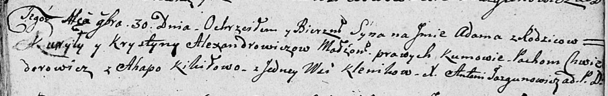

**Кикило Агапа (Kikiłowa Ahapa)**

14 октября 1806 г -- крещение сына Якуба Михала (НИАБ 136-13-894, лист
61, №46/1806-р (ориг)), (РГИА 823-2-18, лист 271, №31/1799-р (коп)).

30 ноября 1808 г -- вероятно, крестная мать Адама, сына Александровичей
Курылы и Крыстыны с деревни Клинники (НИАБ 136-13-894, лист 73,
№46/1808-р (ориг)).

**НИАБ 136-13-894:** Лист 61. **Метрическая запись №46/1806-р (ориг).**

{width="6.496527777777778in"
height="0.8428258967629046in"}

Дедиловичская Покровская церковь. 14 октября 1806 года. Метрическая
запись о крещении.

Kikiło Jakub Michał -- сын родителей с деревни Клинники.

Kikiło Jaśka -- отец.

Kikiłowa Ahapa -- мать.

Łapać Audakim -- кум.

Alexandrowiczowa Krystyna -- кума.

Jazgunowicz Antoni -- ксёндз.

**НИАБ 136-13-894:** Лист 73. **Метрическая запись №46/1808-р (ориг).**

{width="6.496527777777778in"
height="1.027884951881015in"}

Дедиловичская Покровская церковь. 30 ноября 1808 года. Метрическая
запись о крещении.

Alexandrowicz Adam -- сын родителей с деревни Клинники.

Alexandrowicz Kuryła -- отец.

Alexandrowiczowa Krystyna -- мать.

Chwiedorowicz Pachom -- кум, с деревни Клинники.

Kikiłowa Ahapa -- кума, с деревни Клинники.

Jazgunowicz Antoni -- ксёндз.
