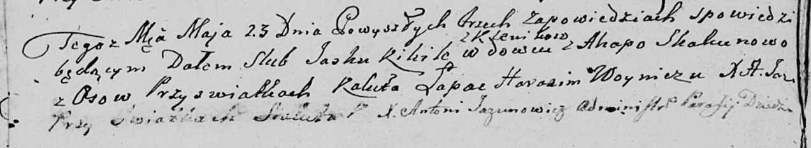

**Кикило Яська (Kikiło Jaśka)**

23 мая 1809 г -- венчание с Агатой Скакун с деревни Осово (НИАБ
136-13-920, лист 15об, №10/1809-б (ориг)).

**НИАБ 136-13-894:** Лист 15об. **Метрическая запись №10/1809-б
(ориг).**

Дедиловичская Покровская церковь. 23 мая 1809 года. Метрическая запись о
венчании.

Kikiło Jaśka -- жених, вдовец, с деревни Клинники.

Skakunowa Agata -- невеста, с деревни Осовo.

Łapac Kaluta -- свидетель.

Woynicz Harasim -- свидетель.

Jazgunowicz Antoni -- ксёндз.
