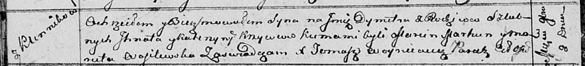

**Кривец Дымитр Игнатов (Krywieć Dymiter)**

8 ноября 1813 г -- крещение (НИАБ 136-13-894, лист 87об, №33/1813-р
(ориг)).

**НИАБ 136-13-894:** Лист 87об. **Метрическая запись №33/1813-р
(ориг).**

Осовская Покровская церковь. 8 ноября 1813 года. Метрическая запись о
крещении.

Kryweć Dymiter -- сын родителей с деревни Клинники.

Kryweć Jhnat -- отец.

Krywcowa Katerzyna -- мать.

Marhun Marcin -- кум.

Wasilewska Maruta -- кума.

Woyniewicz Tomasz -- ксёндз.
