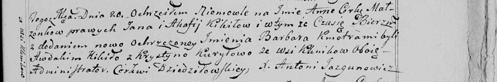

**Курыло Крыстына (Kuryłowa Krystyna)**

20 июля 1799 г -- крестная мать Анны Барбары, Кикил Яна и Агафии с
деревни Клинники (НИАБ 136-13-938, лист 243, №30/1799-р коп)).

**НИАБ 136-13-938:** Лист 243. **Метрическая запись №30/1799-р (коп).**

(См. тж. НИАБ 136-13-894, лист 39, №32/1799-р (ориг); РГИА 823-2-18,
лист 271, №31/1799-р (коп))

{width="6.496527777777778in"
height="1.075in"}

Дедиловичская Покровская церковь. 20 августа 1799 года. Метрическая
запись о крещении.

Kikiłowna Anna Barbara -- дочь родителей с деревни Клинники.

Kikiło Jan -- отец.

Kikiłowa Ahafija -- мать.

Kikiło Awdakim -- кум, с деревни Клинники.

Kuryłowa Krystyna - кума, с деревни Клинники.

Jazgunowicz Antoni -- ксёндз.
