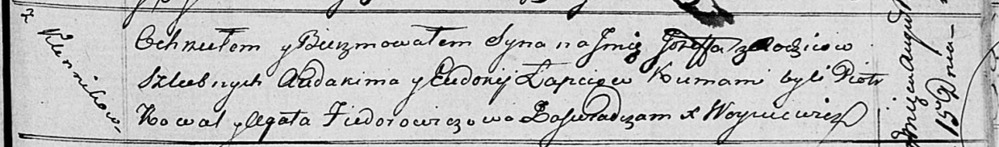

**Лапец Иосиф Авдакимов (Łapiec Jozef)**

15 августа 1816 г -- крещение (НИАБ 136-13-894, лист 94, №24/1816-р
(коп)).

**НИАБ 136-13-894:** Лист 94. **Метрическая запись №24/1816-р (ориг).**

Осовская Покровская церковь. 15 августа 1816 года. Метрическая запись о
крещении.

Łapieć Jozef -- сын родителей с деревни Клинники.

Łapieć Audakim -- отец.

Łapciowa Eudokija -- мать.

Kowal Piotr -- кум.

Fiedorowiczowa Agata -- кума.

Woyniewicz Tomasz -- ксёндз.
