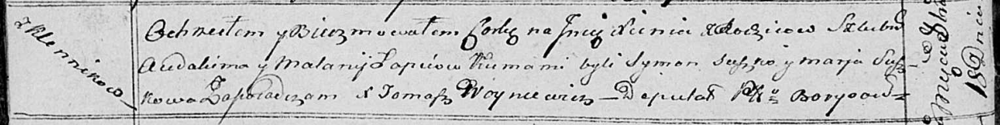

**Лапец Ксеня Авдакимова (Łapciowna Xienia)**

18 октября 1814 г -- крещение (НИАБ 136-13-894, лист 90об, №59/1814-р
(коп)).

**НИАБ 136-13-894:** Лист 90об. **Метрическая запись №59/1814-р
(ориг).**

{width="6.496527777777778in"
height="0.8166754155730533in"}

Осовская Покровская церковь. 18 октября 1814 года. Метрическая запись о
крещении.

Łapciowna Xienia -- дочь родителей с деревни Клинники.

Łapieć Audakim -- отец.

Łapciowa Małanija -- мать.

Suszko Symon -- кум.

Suszkowa Marja -- кума.

Woyniewicz Tomasz -- ксёндз.
