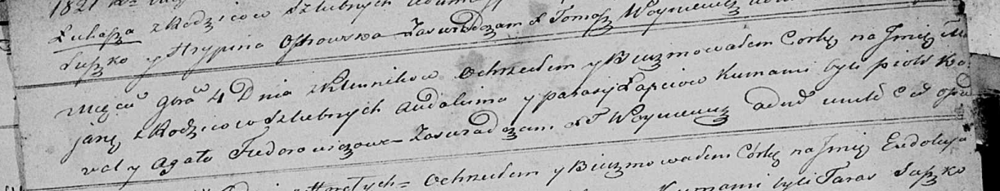

**Лапец Авдахим (Łapac Audachim)**

22 января 1811 г -- венчание с девкой Параской Кикило с деревни Клинники
(НИАБ 136-13-920, лист 17, №2/1811-б (коп)).

1 января 1812 г -- крещение сына Данилы (НИАБ 136-13-894, лист 83,
№1/1812-р (коп)).

4 ноября 1821 г -- крещение дочери Марьяны? (НИАБ 136-13-894, лист
107об, №49/1821-р (коп)).

**НИАБ 136-13-920:** Лист 17. **Метрическая запись №2/1811-б (ориг).**

{width="6.496527777777778in"
height="0.9876541994750656in"}

Осовская Покровская церковь. 22 января 1811 года. Метрическая запись о
венчании.

Łapac Audakim -- жених, вдовец, с деревни Клинники.

Kikiłowna Paraska -- невеста, девка, с деревни Клинники.

Prokulewicz Leon, JP -- свидетель, шляхтич.

Łapac Audakim -- свидетель.

Woyniewicz Tomasz -- ксёндз.

**НИАБ 136-13-894:** Лист 83. **Метрическая запись №1/1812-р (ориг).**

{width="6.496527777777778in"
height="1.5528904199475067in"}

Осовская Покровская церковь. 1 января 1812 года. Метрическая запись о
крещении.

Łapać Daniła -- сын родителей с деревни Клинники.

Łapać Audakim -- отец.

Łapciowa Parasia -- мать.

Kowal Piatruś -- кум.

Fiedorowiczowa Anna -- кума.

Woyniewicz Tomasz -- ксёндз.

**НИАБ 136-13-894:** Лист 107об. **Метрическая запись №49/1821-р
(ориг).**

{width="6.496527777777778in"
height="1.2437871828521434in"}

Осовская Покровская церковь. 4 ноября 1821 года. Метрическая запись о
крещении.

Łapciowna Marjana? -- дочь родителей с деревни Клинники.

Łapiec Audakim -- отец.

Łapciowa Parasia -- мать.

Kowal Piotr -- кум.

Fiedorowiczowa Agata -- кума.

Woyniewicz Tomasz -- ксёндз.
