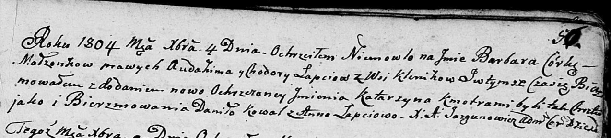

**Лапец Барбара Авдахимова (Łapciowna Barbara Katarzyna)**

4 декабря 1804 г -- крещение (НИАБ 136-13-894, лист 56, №57/1804-р
(коп)).

**НИАБ 136-13-894:** Лист 56. **Метрическая запись №57/1804-р (ориг).**

Дедиловичская Покровская церковь. 4 декабря 1804 года. Метрическая
запись о крещении.

Łapciowna Barbara Katarzyna -- дочь родителей с деревни Клинники.

Łapać Audachim -- отец.

Łapciowa Chodora -- мать.

Kowal Daniło -- кум.

Łapciowa Anna -- кума.

Jazgunowicz Antoni -- ксёндз.
