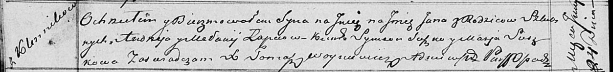

**Лапец Мелания (Łapciowa Mełanija)**

24 июня 1818 г -- крещение сына Яна (НИАБ 136-13-894, лист 98об,
№20/1818-р (коп)).

**НИАБ 136-13-894:** Лист 98об. **Метрическая запись №20/1818-р
(ориг).**

Осовская Покровская церковь. 24 июня 1818 года. Метрическая запись о
крещении.

Łapieć Jan -- сын родителей с деревни Клинники.

Łapieć Andrzey -- отец.

Łapciowa Mełanija -- мать.

Suszko Symeon -- кум.

Suszkowa Marja -- кума.

Woyniewicz Tomasz -- ксёндз.
