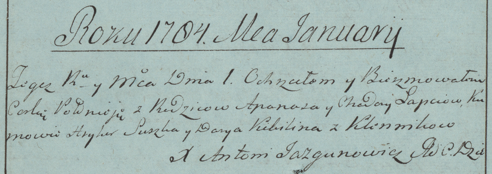

**Лапец Ходора (Łapiec Chodora)**

1 января 1784 г -- крещение дочери Полонеи (РГИА 823-2-18, лист 225об,
№1/1784-р (коп)).

**РГИА 823-2-18:** Лист 225об. **Метрическая запись №1/1784-р (коп).**

{width="6.496527777777778in"
height="2.3055555555555554in"}

Дедиловичская Покровская церковь. 1 января 1784 года. Метрическая запись
о крещении.

Łapciewna Połonieja -- дочь родителей с деревни Клинники.

Łapec Apanas -- отец.

Łapciowa Chodora -- мать.

Suszka Hryhor -- кум.

Kikilina Darya - кума.

Jazgunowicz Antoni -- ксёндз.
