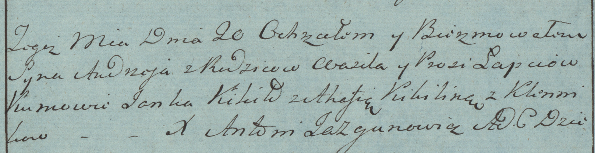

**Лапец Андрей Василев (Łapiec Andrzey)**

20 августа 1783 г -- крещение (РГИА 823-2-18, лист 225, №22/1783-р
(коп)).

**РГИА 823-2-18:** Лист 225. **Метрическая запись №22/1783-р (коп).**

{width="6.496527777777778in"
height="1.6756944444444444in"}

Дедиловичская Покровская церковь. 20 августа 1783 года. Метрическая
запись о крещении.

Łapiec Andrzey -- сын родителей с деревни Клинники.

Łapiec Wasil -- отец.

Łapciowa Prosia -- мать.

Kikiło Janka -- кум.

Kikilina Ahafija - кума.

Jazgunowicz Antoni -- ксёндз.
