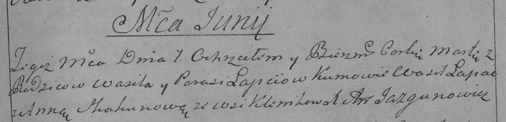

**Лапец Марта Василева (Łapciowna Marta)**

7 июня 1789 г -- крещение (НИАБ 136-13-894, лист 7, №31/1789-р (ориг)),
(РГИА 823-2-18, лист 238, №12/1789-р (коп)).

**НИАБ 136-13-894:** Лист 7. **Метрическая запись №31/1789-р (ориг).**

Дедиловичская Покровская церковь. 7 июня 1789 года. Метрическая запись о
крещении.

Łapciowna Marta -- дочь родителей с деревни Клинники.

Łapać Wasil -- отец.

Łapciowa Parasia -- мать.

Łapać Wasil - кум.

Skakunowa Anna - кума.

Jazgunowicz Antoni -- ксёндз.

**РГИА 823-2-18:** Лист 238. **Метрическая запись №12/1789-р (коп).**

Дедиловичская Покровская церковь. 7 июня 1789 года. Метрическая запись о
крещении.

Łapciowna Marta -- дочь родителей с деревни Клинники.

Łapiec Wasil -- отец.

Łapciowa Parasia -- мать.

Łapac Wasil -- кум.

Skakunowa Anna - кума.

Jazgunowicz Antoni -- ксёндз.
