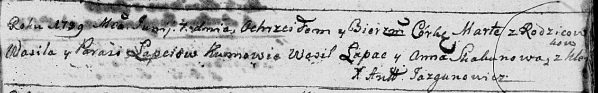

**Лапец Прося (Łapciowa Prosia, Parasia)**

20 августа 1783 г -- крещение сына Андрея (РГИА 823-2-18, лист 225,
№22/1783-р (коп)).

1 октября 1784 г -- крещение сына Яна (РГИА 823-2-18, лист 227об,
№20/1784-р (коп)).

7 июня 1789 г -- крещение дочери Марты (НИАБ 136-13-894, лист 7,
№31/1789-р (ориг)), (РГИА 823-2-18, лист 238, №12/1789-р (коп)).

**РГИА 823-2-18:** Лист 225. **Метрическая запись №22/1783-р (коп).**

{width="6.496527777777778in"
height="1.6756944444444444in"}

Дедиловичская Покровская церковь. 20 августа 1783 года. Метрическая
запись о крещении.

Łapiec Andrzey -- сын родителей с деревни Клинники.

Łapiec Wasil -- отец.

Łapciowa Prosia -- мать.

Kikiło Janka -- кум.

Kikilina Ahafija - кума.

Jazgunowicz Antoni -- ксёндз.

**РГИА 823-2-18:** Лист 227об. **Метрическая запись №20/1784-р (коп).**

{width="6.496527777777778in"
height="2.5118055555555556in"}

Дедиловичская Покровская церковь. 1 октября 1784 года. Метрическая
запись о крещении.

Łapiec Jan -- сын родителей с деревни Клинники.

Łapiec Wasil -- отец.

Łapciowa Parasia -- мать.

Kikiło Jan -- кум.

Kikiłowa Ahapa - кума.

Jazgunowicz Antoni -- ксёндз.

**НИАБ 136-13-894:** Лист 7. **Метрическая запись №31/1789-р (ориг).**

{width="6.496527777777778in"
height="1.0138046806649168in"}

Дедиловичская Покровская церковь. 7 июня 1789 года. Метрическая запись о
крещении.

Łapćiowa Marta -- дочь родителей с деревни Клинники.

Łapać Wasil -- отец.

Łapćiowa Parasia -- мать.

Łapać Wasil - кум.

Skakunowa Anna - кума.

Jazgunowicz Antoni -- ксёндз.

**РГИА 823-2-18:** Лист 238. **Метрическая запись №12/1789-р (коп).**

{width="6.496527777777778in"
height="1.573611111111111in"}

Дедиловичская Покровская церковь. 7 июня 1789 года. Метрическая запись о
крещении.

Łapciowna Marta -- дочь родителей с деревни Клинники.

Łapiec Wasil -- отец.

Łapciowa Parasia -- мать.

Łapac Wasil -- кум.

Skakunowa Anna - кума.

Jazgunowicz Antoni -- ксёндз.
