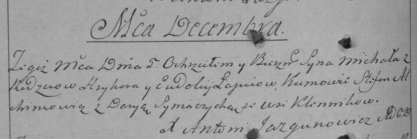

**Лапец Миколай Грыгоров (Łapać Mikołay)**

5 декабря 1792 г -- крещение (НИАБ 136-13-894, лист 17об, №81/1792-р
(ориг)), (РГИА 823-2-18, лист 245, №36/1792-р (коп)).

**НИАБ 136-13-894:** Лист 17-об. **Метрическая запись №81/1792-р
(ориг).**

{width="6.496527777777778in"
height="0.9239566929133858in"}

Дедиловичская Покровская церковь. 5 декабря 1792 года. Метрическая
запись о крещении.

Łapać Mikołay -- сын родителей с деревни Клинники.

Łapać Hryhor -- отец.

Łapciowa Ewdokija -- мать.

Alchimowicz Stefan - кум.

Siniaczycha Daryia - кума.

Jazgunowicz Antoni -- ксёндз.

**РГИА 823-2-18:** Лист 245об. **Метрическая запись №36/1792-р (коп).**

{width="6.496527777777778in"
height="2.1680555555555556in"}

Дедиловичская Покровская церковь. 5 декабря 1792 года. Метрическая
запись о крещении.

Łapiec Michał -- сын родителей с деревни Клинники.

Łapiec Hryhor -- отец.

Łapciowa Eudokija -- мать.

Alchimowicz Stefan -- кум.

Syniaczycha Darya -- кума.

Jazgunowicz Antoni -- ксёндз.
