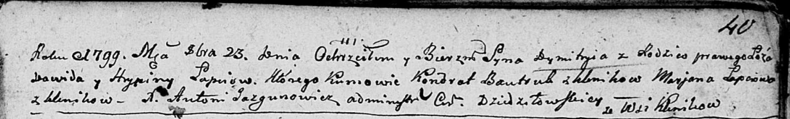
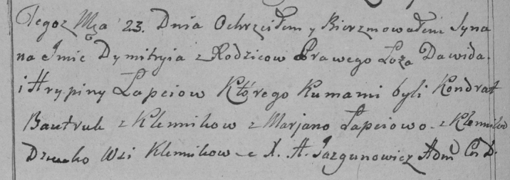
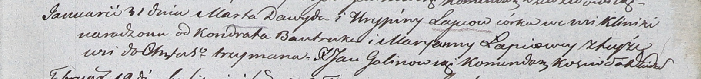
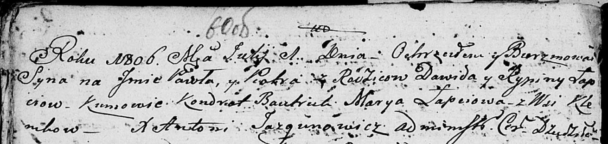

**Лапец Грыпина (Łapcewa Hrypina, Rypina)**

23 октября 1799 г -- крещение сына Дымитрия (НИАБ 136-13-894, лист 40,
№42/1799-р (ориг)), (РГИА 823-2-18, лист 272об, №41/1799-р (коп)).

31 января 1804 г -- крещение дочери Марты (НИАБ 937-4-32, лист 10,
№3/1804-р).

1 июля 1806 г -- крещение сына Павла Петра (НИАБ 136-13-894, лист 60об,
№27/1806-р (ориг)).

**НИАБ 136-13-894:** Лист 40. **Метрическая запись №42/1799-р (ориг).**

Дедиловичская Покровская церковь. 23 октября 1799 года. Метрическая
запись о крещении.

Łapac Dymitry -- сын родителей с деревни Клинники.

Łapac Dawid -- отец.

Łapciowa Hrypina -- мать.

Bautruk Kondrat -- кум, с деревня Клинники.

Łapciowa Marjana -- кума, с деревня Клинники.

Jazgunowicz Antoni -- ксёндз.

**РГИА 823-2-18:** Лист 272об. **Метрическая запись №41/1799-р (коп).**

Дедиловичская Покровская церковь. 23 октября 1799 года. Метрическая
запись о крещении.

Łapiec Dymitry -- сын родителей с деревни Клинники.

Łapiec Dawid -- отец.

Łapciowa Hrypina -- мать.

Bautruk Kondrat -- кум, с деревни Клинники.

Łapciowa Marjana -- кума, с деревни Клинники.

Jazgunowicz Antoni -- ксёндз.

**НИАБ 937-4-32:** Лист 10. **Метрическая запись №3/1804-р.**

Дедиловичский костел Наисвятейшего Сердца Иисуса. 31 января 1804 года.
Метрическая запись о крещении.

Łapciowna Marta -- дочь родителей с деревни Клинники.

Łapiec Dawyd -- отец.

Łapciowa Hrypina -- мать.

Bautruk Kondrat -- крестный отец.

Łapciowa Maryanna -- крестная мать, с деревни Клинники.

Galinowski Joann -- ксёндз, комендант Дедиловичского костела.

**НИАБ 136-13-894:** Лист 60об. **Метрическая запись №27/1806-р
(ориг).**

Дедиловичская Покровская церковь. 1 июля 1806 года. Метрическая запись о
крещении.

Łapać Paweł Piotr -- сын родителей с деревни Клинники.

Łapać Dawid -- отец.

Łapciowa Rypina -- мать.

Bautruk Kondrat -- кум.

Łapciowa Marya -- кума.

Jazgunowicz Antoni -- ксёндз.
