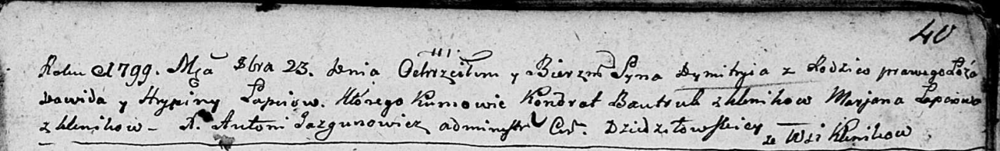
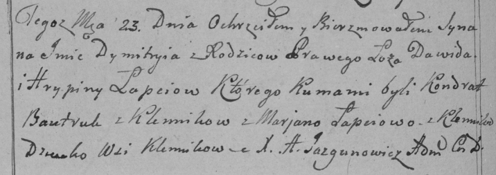

**Лапец Дымитры Дваидов (Łapaс Dymitry)**

23 октября 1799 г -- крещение (НИАБ 136-13-894, лист 40, №42/1799-р
(ориг)), (РГИА 823-2-18, лист 272об, №41/1799-р (коп)).

**НИАБ 136-13-894:** Лист 40. **Метрическая запись №42/1799-р (ориг).**

Дедиловичская Покровская церковь. 23 октября 1799 года. Метрическая
запись о крещении.

Łapac Dymitry -- сын родителей с деревни Клинники.

Łapac Dawid -- отец.

Łapciowa Hrypina -- мать.

Bautruk Kondrat -- кум, с деревня Клинники.

Łapciowa Marjana -- кума, с деревня Клинники.

Jazgunowicz Antoni -- ксёндз.

**РГИА 823-2-18:** Лист 272об. **Метрическая запись №41/1799-р (коп).**

Дедиловичская Покровская церковь. 23 октября 1799 года. Метрическая
запись о крещении.

Łapiec Dymitry -- сын родителей с деревни Клинники.

Łapiec Dawid -- отец.

Łapciowa Hrypina -- мать.

Bautruk Kondrat -- кум, с деревни Клинники.

Łapciowa Marjana -- кума, с деревни Клинники.

Jazgunowicz Antoni -- ксёндз.
