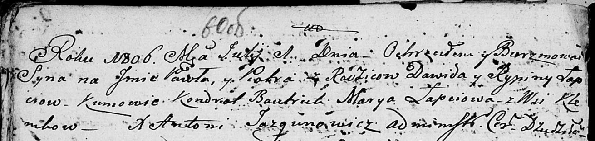

**Лапец Павел Давидов (Łapac Paweł Piotr)**

1 июля 1806 г -- крещение (НИАБ 136-13-894, лист 60об, №27/1806-р
(ориг)).

**НИАБ 136-13-894:** Лист 60об. **Метрическая запись №27/1806-р
(ориг).**

Дедиловичская Покровская церковь. 1 июля 1806 года. Метрическая запись о
крещении.

Łapać Paweł Piotr -- сын родителей с деревни Клинники.

Łapać Dawid -- отец.

Łapciowa Rypina -- мать.

Bautruk Kondrat -- кум.

Łapciowa Marya -- кума.

Jazgunowicz Antoni -- ксёндз.
