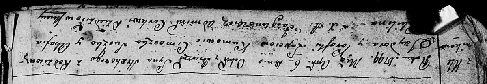

**Лапец Грыгоры Изыдоров (Łapać Hrehory)**

6 апреля 1799 г -- крещение (ошибочно Ян Прокоп 24 апреля) (НИАБ
136-13-894, лист 38об, №18/1799-р (ориг)), (РГИА 823-2-18, лист 269,
№18/1799-р (коп), НИАБ 136-13-938, лист 241об, №17/1799-р (коп)).

**НИАБ 136-13-894:** Лист 38об. **Метрическая запись №18/1799-р
(ориг).**

Дедиловичская Покровская церковь. 6 апреля 1799 года. Метрическая запись
о крещении.

Łapać Hrehory-- сын родителей с деревни Клинники.

Łapać Jzydor -- отец.

Łapciowa Paraska -- мать.

Suszko Cimoszka-- кум.

Kikilina Ahafia -- кума.

Jazgunowicz Antoni -- ксёндз.

**РГИА 823-2-18:** Лист 269. **Метрическая запись №18/1799-р (коп).**

Дедиловичская Покровская церковь. 26 апреля 1799 года. Метрическая
запись о крещении.

Łapiec Hrehory -- сын родителей с деревни Клинники.

Łapiec Jzydor -- отец.

Łapciowa Paraska -- мать.

Suszko Cimoszka -- кум, с деревни Клинники.

Kikilina Ahafia -- кума, с деревни Клинники.

Jazgunowicz Antoni -- ксёндз.

**НИАБ 136-13-938:** Лист 241об. **Метрическая запись №17/1799-р
(коп).**

(См. тж. НИАБ 136-13-894, лист 38об, №18/1799-р (ориг); РГИА 823-2-18,
лист 269, №18/1799-р (коп))

Дедиловичская Покровская церковь. 24 апреля 1799 года. Метрическая
запись о крещении.

Łapać Jan Prokop -- сын родителей с деревни Клинники.

Łapać Jzydor -- отец.

Łapciowa Parasia -- мать.

Suszko Cimoszka -- кум, с деревни Разлитье.

Suszkowa Kulina - кума, с деревни Разлитье.

Jazgunowicz Antoni -- ксёндз.
