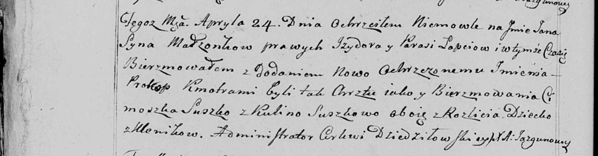

**Лапец Изыдор (Łapać Jzydor)**

6 (ошибочно 24) апреля 1799 г -- крещение сына Грыгорыя (ошибочно Яна
Прокопа) (НИАБ 136-13-894, лист 38об, №18/1799-р (ориг)), (РГИА
823-2-18, лист 269, №18/1799-р (коп), НИАБ 136-13-938, лист 241об,
№17/1799-р (коп)).

2 апреля 1801 г -- крещение сына Якуба Балтромея (НИАБ 136-13-894, лист
43об, №11/1801-р (ориг)).

**НИАБ 136-13-894:** Лист 38об. **Метрическая запись №18/1799-р
(ориг).**

{width="6.496527777777778in"
height="1.1318132108486438in"}

Дедиловичская Покровская церковь. 6 апреля 1799 года. Метрическая запись
о крещении.

Łapać Hrehory-- сын родителей с деревни Клинники.

Łapać Jzydor -- отец.

Łapciowa Paraska -- мать.

Suszko Cimoszka-- кум.

Kikilina Ahafia -- кума.

Jazgunowicz Antoni -- ксёндз.

**РГИА 823-2-18:** Лист 269. **Метрическая запись №18/1799-р (коп).**

{width="6.496527777777778in"
height="1.4277777777777778in"}

Дедиловичская Покровская церковь. 26 апреля 1799 года. Метрическая
запись о крещении.

Łapiec Hrehory -- сын родителей с деревни Клинники.

Łapiec Jzydor -- отец.

Łapciowa Paraska -- мать.

Suszko Cimoszka -- кум, с деревни Клинники.

Kikilina Ahafia -- кума, с деревни Клинники.

Jazgunowicz Antoni -- ксёндз.

**НИАБ 136-13-938:** Лист 241об. **Метрическая запись №17/1799-р
(коп).**

(См. тж. НИАБ 136-13-894, лист 38об, №18/1799-р (ориг); РГИА 823-2-18,
лист 269, №18/1799-р (коп))

{width="6.496527777777778in"
height="1.7027777777777777in"}

Дедиловичская Покровская церковь. 24 апреля 1799 года. Метрическая
запись о крещении.

Łapać Jan Prokop -- сын родителей с деревни Клинники.

Łapać Jzydor -- отец.

Łapciowa Parasia -- мать.

Suszko Cimoszka -- кум, с деревни Разлитье.

Suszkowa Kulina - кума, с деревни Разлитье.

Jazgunowicz Antoni -- ксёндз.

**НИАБ 136-13-894:** Лист 43об. **Метрическая запись №11/1801-р
(ориг).**

{width="6.496527777777778in"
height="1.7848851706036746in"}

Дедиловичская Покровская церковь. 2 апреля 1801 года. Метрическая запись
о крещении.

Łapać Jakub Baltromiey -- сын родителей \[с деревни Клинники\].

Łapać Jzydor -- отец.

Łapciowa Parasia -- мать.

Suszko Cimoszka -- кум.

Bautrukowa Ahapa -- кума.

Jazgunowicz Antoni -- ксёндз.
