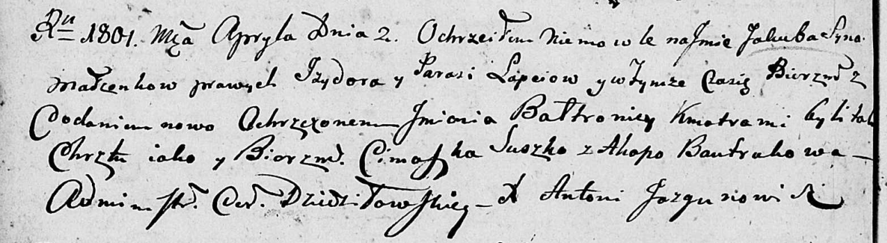

**Лапец Якуб Изыдоров (Łapać Jzydor Bałtromiey)**

2 апреля 1801 г -- крещение (НИАБ 136-13-894, лист 43об, №11/1801-р
(ориг)).

**НИАБ 136-13-894:** Лист 43об. **Метрическая запись №11/1801-р
(ориг).**

Дедиловичская Покровская церковь. 2 апреля 1801 года. Метрическая запись
о крещении.

Łapać Jakub Baltromiey -- сын родителей \[с деревни Клинники\].

Łapać Jzydor -- отец.

Łapciowa Parasia -- мать.

Suszko Cimoszka -- кум.

Bautrukowa Ahapa -- кума.

Jazgunowicz Antoni -- ксёндз.
