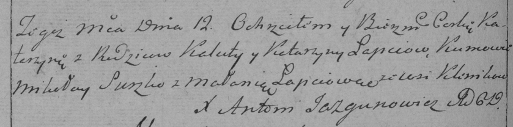

**Лапец Катерина Калистова (Łapciowna Katerzyna)**

12 ноября 1786 г -- крещение (РГИА 823-2-18, лист 232об, №27/1786-р
(коп)).

**РГИА 823-2-18:** Лист 232об. **Метрическая запись №27/1786-р (коп).**

{width="6.496527777777778in"
height="1.6104166666666666in"}

Дедиловичская Покровская церковь. 12 ноября 1786 года. Метрическая
запись о крещении.

Łapciowna Katerzyna -- дочь родителей с деревни Клинники.

Łapiec Kaluta -- отец.

Łapciowa Katarzyna -- мать.

Suszko Mikołay -- кум.

Łapciowa Małania - кума.

Jazgunowicz Antoni -- ксёндз.
