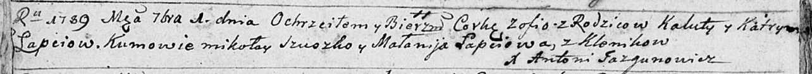

**Лапец Катерина (Łapciowa Katerzyna, Katarzyna, Katryna)**

19 мая 1784 г -- крещение сына Карпа (РГИА 823-2-18, лист 226об,
№12/1784-р (коп)).

12 ноября 1786 г -- крещение дочери Катерыны (РГИА 823-2-18, лист 232об,
№27/1786-р (коп)).

1 сентября 1789 г -- крещение дочери Зофьи (НИАБ 136-13-894, лист 7об,
№44/1789-р (ориг)).

3 апреля 1793 г -- крещение сына Марцина (НИАБ 136-13-894, лист 19об,
№34/1793-р (ориг)), (РГИА 823-2-18, лист 247, №14/1793-р (коп)).

19 июля 1803 г -- крестная мать Пракседы, дочери Курылы и Крыстыны
Александровичей с деревни Клинники (НИАБ 937-4-32, лист 9об,
№16/1803-р).

**РГИА 823-2-18:** Лист 226об. **Метрическая запись №12/1784-р (коп).**

{width="6.496527777777778in"
height="1.6958333333333333in"}

Дедиловичская Покровская церковь. 19 мая 1784 года. Метрическая запись о
крещении.

Łapec Karp -- сын родителей с деревни Клинники.

Łapec Kalist -- отец.

Łapciowa Katarzyna -- мать.

Suszko Wasil -- кум.

Bautrukowa Małania - кума.

Jazgunowicz Antoni -- ксёндз.

**РГИА 823-2-18:** Лист 232об. **Метрическая запись №27/1786-р (коп).**

{width="6.496527777777778in"
height="1.6104166666666666in"}

Дедиловичская Покровская церковь. 12 ноября 1786 года. Метрическая
запись о крещении.

Łapciowna Katerzyna -- дочь родителей с деревни Клинники.

Łapiec Kaluta -- отец.

Łapciowa Katarzyna -- мать.

Suszko Mikołay -- кум.

Łapciowa Małania - кума.

Jazgunowicz Antoni -- ксёндз.

**НИАБ 136-13-894:** Лист 7об. **Метрическая запись №44/1789-р (ориг).**

{width="6.496527777777778in"
height="0.6021139545056868in"}

Дедиловичская Покровская церковь. 1 сентября 1789 года. Метрическая
запись о крещении.

Łapciowna Zofia -- дочь родителей с деревни Клинники.

Łapać Kaluta -- отец.

Łapciowa Katryna -- мать.

Szuszko Mikołay - кум.

Łapciowa Małanija - кума.

Jazgunowicz Antoni -- ксёндз.

**НИАБ 136-13-894:** Лист 19-об. **Метрическая запись №34/1793-р
(ориг).**

{width="6.496527777777778in"
height="0.875680227471566in"}

Дедиловичская Покровская церковь. 3 апреля 1793 года. Метрическая запись
о крещении.

Łapać Marcin -- сын родителей с деревни Клинники.

Łapać Kaluta -- отец.

Łapać Katerzyna -- мать.

Suszko Mikołay - кум.

Bautrukowa Małanija - кума.

Jazgunowicz Antoni -- ксёндз.

**РГИА 823-2-18:** Лист 247. **Метрическая запись №14/1793-р (коп).**

{width="6.496527777777778in"
height="2.0006944444444446in"}

Дедиловичская Покровская церковь. 3 апреля 1793 года. Метрическая запись
о крещении.

Łapiec Maciey -- сын родителей с деревни Клинники.

Łapiec Kaluta -- отец.

Łapciowa Katarzyna -- мать.

Suszko Mikołay -- кум.

Bautrukowa Małania -- кума.

Jazgunowicz Antoni -- ксёндз.

**НИАБ 937-4-32:** Лист 9об. **Метрическая запись №16/1803-р.**

{width="6.496527777777778in"
height="0.7395833333333334in"}

Дедиловичский костел Наисвятейшего Сердца Иисуса. 19 июля 1803 года.
Метрическая запись о крещении.

Alexandrowiczowna Praxeda -- дочь крестьян с деревни Клинники.

Alexandrowicz Kuriło -- отец.

Alexandrowiczowa Christina -- мать.

Chwiedorowicz Prochor -- крестный отец, с деревни Клинники.

Łapciowa Catharina -- крестная мать, с деревни Клинники.

Galinowski Joann -- ксёндз, комендант Дедиловичского костела.
