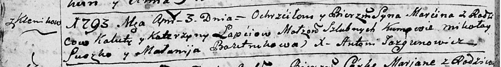
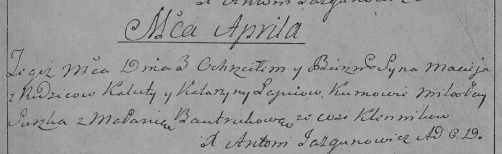

**Лапец Марцин Калистов (Łapać Marcin)**

3 апреля 1793 г -- крещение (НИАБ 136-13-894, лист 19об, №34/1793-р
(ориг)), (РГИА 823-2-18, лист 247, №14/1793-р (коп)).

**НИАБ 136-13-894:** Лист 19-об. **Метрическая запись №34/1793-р
(ориг).**

Дедиловичская Покровская церковь. 3 апреля 1793 года. Метрическая запись
о крещении.

Łapać Marcin -- сын родителей с деревни Клинники.

Łapać Kaluta -- отец.

Łapać Katerzyna -- мать.

Suszko Mikołay - кум.

Bautrukowa Małanija - кума.

Jazgunowicz Antoni -- ксёндз.

**РГИА 823-2-18:** Лист 247. **Метрическая запись №14/1793-р (коп).**

Дедиловичская Покровская церковь. 3 апреля 1793 года. Метрическая запись
о крещении.

Łapiec Maciey -- сын родителей с деревни Клинники.

Łapiec Kaluta -- отец.

Łapciowa Katarzyna -- мать.

Suszko Mikołay -- кум.

Bautrukowa Małania -- кума.

Jazgunowicz Antoni -- ксёндз.
