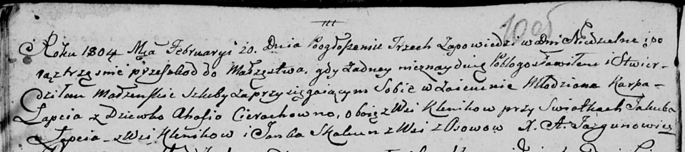

**Лапец Карп (Łapac Karp)**

20 февраля 1804 г -- венчание с девкой Агапой Церах с деревни Клинники
(НИАБ 136-13-920, лист 10об, №4/1804-б (ориг)).

**НИАБ 136-13-920:** Лист 10об. **Метрическая запись №4/1804-б (ориг).**

Дедиловичская Покровская церковь. 20 февраля 1804 года. Метрическая
запись о венчании.

Łapac Karp -- жених, молодой, с деревни Клинники.

Cierachowna Ahapa -- невеста, девка, с деревни Клинники.

Łapac Jakub -- свидетель, с деревни Клинники.

Skakun Janka -- свидетель, с деревни Осовo.

Jazgunowicz Antoni -- ксёндз.
