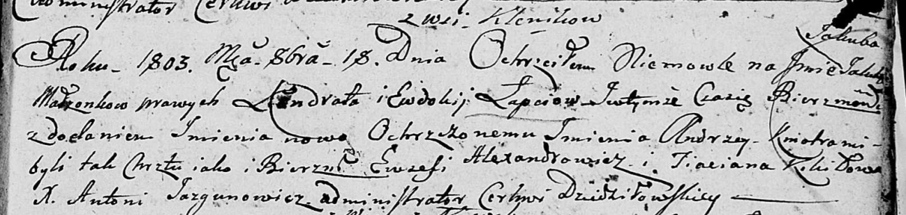

**Лапец Якуб Кондратов (Łapać Jakub Andrzey)**

18 октября 1803 г -- крещение (НИАБ 136-13-894, лист 52, №43/1803-р
(ориг)).

**НИАБ 136-13-894:** Лист 52. **Метрическая запись №43/1803-р (ориг).**

Дедиловичская Покровская церковь. 18 октября 1803 года. Метрическая
запись о крещении.

Łapać Jakub Andrzey -- сын родителей с деревни Клинники.

Łapać Kondrat -- отец.

Łapciowa Ewdokija -- мать.

Alexandrowicz Ewzefi -- кум.

Kikiłowa Taciana -- кума.

Jazgunowicz Antoni -- ксёндз.
