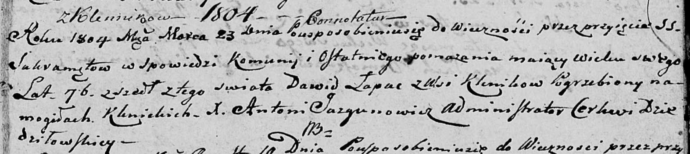

**Лапец Давид (Łapас Dawid)**

23 марта 1804 г -- отпевание, умер в возрасте 76 лет (родился около 1728
г) (НИАБ 136-13-919, лист 15, №4/1804-у (ориг)).

**НИАБ 136-13-919:** Лист 15. **Метрическая запись №4/1804-у (ориг).**

Дедиловичская Покровская церковь. 23 марта 1804 года. Метрическая запись
об отпевании.

Łapać Dawid -- умерший, 76 лет, с деревни Клинники, похоронен на
кладбище деревни Клинники.

Jazgunowicz Antoni -- ксёндз.
