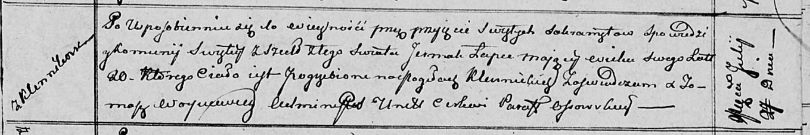

**Лапец Ермак (Łapeс Ermak)**

27 июля 1812 г -- отпевание, умер в возрасте 20 лет (родился около 1792
г) (НИАБ 136-13-919, лист 24, №13/1812-у (ориг)).

**НИАБ 136-13-919:** Лист 24. **Метрическая запись №13/1812-у (ориг).**

Осовская униатская церковь. 27 июля 1812 года. Метрическая запись об
отпевании.

Łapec Jermak -- умерший, 20 лет, с деревни Клинники, похоронен на
кладбище деревни Клинники.

Woyniewicz Tomasz -- ксёндз.
