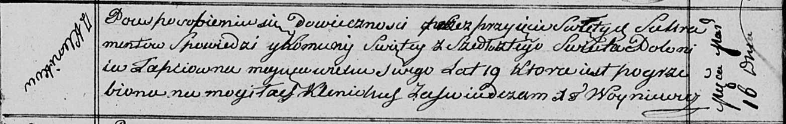

**Лапец Полония (Łapciowna Połonia)**

16 марта 1813 г -- отпевание, умерла в возрасте 19 лет (родилась около
1794 г) (НИАБ 136-13-919, лист 26, №24/1813-у (ориг)).

**НИАБ 136-13-919:** Лист 26. **Метрическая запись №24/1813-у (ориг).**

Осовская униатская церковь. 16 марта 1813 года. Метрическая запись об
отпевании.

Łapciowna Połonia -- умершая, 19 лет, с деревни Клинники, похоронена на
кладбище деревни Клинники.

Woyniewicz Tomasz -- ксёндз.
