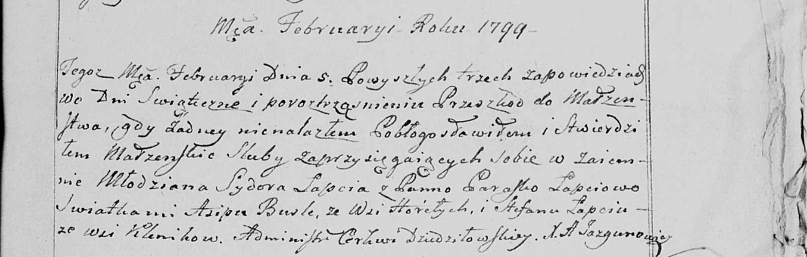

**Лапец Стефан (Łapiec Stefan)**

5 февраля 1799 г -- свидетель венчания молодого Лапеца Сидора с деревни
Клинники с Параской Лапец с деревни Клинники (НИАБ 136-13-938, лист 246,
№2/1799-б (коп)).

**НИАБ 136-13-938:** Лист 246. **Метрическая запись №2/1799-б (коп).**

(См. тж. НИАБ 136-13-920, лист 6, №2/1799-б (ориг))

Дедиловичская Покровская церковь. 5 февраля 1799 года. Метрическая
запись о венчании.

Łapać Sydor -- жених, молодой, с деревни \[Клинники\].

Łapciowa Paraska -- невеста, с деревни \[Клинники\].

Busłą Asip -- свидетель, с деревни Горелое.

Łapać Stefan -- свидетель, с деревни Клинники.

Jazgunowicz Antoni -- ксёндз.
