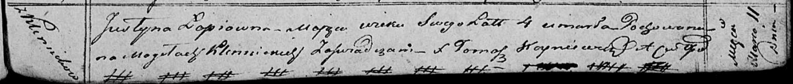

**Лапец Юстына (Łapciowna Justyna)**

11 марта 1820 г -- отпевание, умерла в возрасте 4 лет (родилась около
1816 г) (НИАБ 136-13-919, лист 33, №4/1820-у (ориг)).

**НИАБ 136-13-919:** Лист 33. **Метрическая запись №4/1820-у (ориг).**

Осовская униатская церковь. 11 марта 1820 года. Метрическая запись об
отпевании.

Łapciowna Justyna -- умершая, 4 года, с деревни Клинники, похоронена на
кладбище деревни Клинники.

Woyniewicz Tomasz -- ксёндз.
