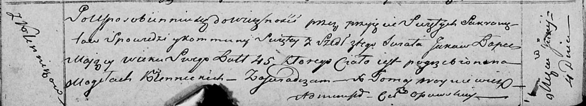

**Лапец Яков (Łapаc Jakow)**

4 июня 1818 г -- отпевание, умер в возрасте 45 лет (родился около 1773
г) (НИАБ 136-13-919, лист 31об, №9/1818-у (ориг)).

**НИАБ 136-13-919:** Лист 31об. **Метрическая запись №9/1818-у (ориг).**

Осовская униатская церковь. 4 июня 1818 года. Метрическая запись об
отпевании.

Łapec Jakow -- умерший, 45 лет, с деревни Клинники, похоронен на
кладбище деревни Клинники.

Woyniewicz Tomasz -- ксёндз.
