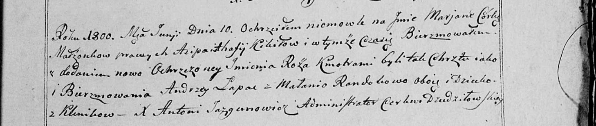

**Лапец Ян (Łapаc Jan)**

9 августа 1798 г -- отпевание (НИАБ 136-13-920, лист 6об, №1/1800-б
(ориг)).

**НИАБ 136-13-919:** Лист 7об. **Метрическая запись №11/1798-у (ориг).**

{width="6.496527777777778in"
height="0.9076388888888889in"}

Дедиловичская Покровская церковь. 9 августа 1798 года. Метрическая
запись об отпевании.

Łapać Jan -- умерший, с деревни Клинники, похоронен на кладбище деревни
Клинники.

Jazgunowicz Antoni -- ксёндз.
