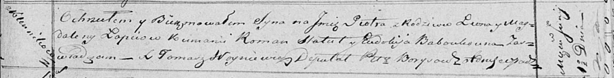

**Лапец Магдалена (Łapciowa Magdalena)**

1 июня 1819 г -- крещение сына Петра (НИАБ 136-13-894, лист 101,
№27/1819-р (ориг)).

**НИАБ 136-13-894:** Лист 101. **Метрическая запись №27/1819-р (ориг).**

{width="6.496527777777778in"
height="0.8347790901137357in"}

Осовская Покровская церковь. 1 июня 1819 года. Метрическая запись о
крещении.

Łapieć Piotr -- сын родителей с деревни Клинники.

Łapieć Leon -- отец.

Łapciowa Magdalena -- мать.

Statuł? Roman -- кум.

Baboukowna Eudokija -- кума.

Woyniewicz Tomasz -- ксёндз.
