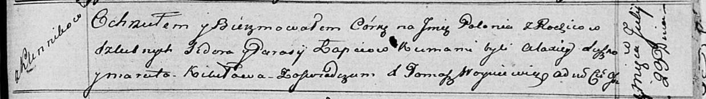

**Лапец (Лапец) Парася (Łapciowa (Łapciowa) Parasia)**

5 февраля 1799 г -- венчание с Сидером Лапецом с деревни Клинники (НИАБ
136-13-920, лист 6, №2/1799-б (ориг), НИАБ 136-13-938, лист 246,
№2/1799-б (коп)).

23 июля 1816 г -- крещение дочери Полонии (НИАБ 136-13-894, лист 94,
№19/1816-р (ориг)).

**НИАБ 136-13-920:** Лист 6. **Метрическая запись №2/1799-б (ориг).**

{width="6.496527777777778in"
height="1.0540343394575677in"}

Дедиловичская Покровская церковь. 5 февраля 1799 года. Метрическая
запись о венчании.

Łapiec Syder -- жених, деревня Клинники.

Łapciowa Paraska -- невеста, деревня Клинники.

Busło Osip -- свидетель.

Łapiec Stefan -- свидетель.

Jazgunowicz Antoni -- ксёндз.

**НИАБ 136-13-938:** Лист 246. **Метрическая запись №2/1799-б (коп).**

(См. тж. НИАБ 136-13-920, лист 6, №2/1799-б (ориг))

{width="6.496527777777778in"
height="2.078472222222222in"}

Дедиловичская Покровская церковь. 5 февраля 1799 года. Метрическая
запись о венчании.

Łapać Sydor -- жених, молодой, с деревни \[Клинники\].

Łapciowa Paraska -- невеста, с деревни \[Клинники\].

Busłą Asip -- свидетель, с деревни Горелое.

Łapać Stefan -- свидетель, с деревни Клинники.

Jazgunowicz Antoni -- ксёндз.

**НИАБ 136-13-894:** Лист 94. **Метрическая запись №19/1816-р (ориг).**

{width="6.496527777777778in"
height="0.9185925196850394in"}

Осовская Покровская церковь. 23 июля 1816 года. Метрическая запись о
крещении.

Łapciowna Połonia -- дочь родителей с деревни Клинники.

Łapieć Sider -- отец.

Łapciowa Parasija -- мать.

Suszko Alaxiey -- кум.

Kikiłowa Maruta -- кума.

Woyniewicz Tomasz -- ксёндз.
