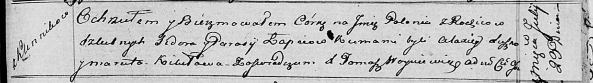

**Лапец Полония Сидорова (Łapciowna Połonia)**

23 июля 1816 г -- крещение (НИАБ 136-13-894, лист 94, №19/1816-р
(ориг)).

**НИАБ 136-13-894:** Лист 94. **Метрическая запись №19/1816-р (ориг).**

Осовская Покровская церковь. 23 июля 1816 года. Метрическая запись о
крещении.

Łapciowna Połonia -- дочь родителей с деревни Клинники.

Łapieć Sider -- отец.

Łapciowa Parasija -- мать.

Suszko Alaxiey -- кум.

Kikiłowa Maruta -- кума.

Woyniewicz Tomasz -- ксёндз.
