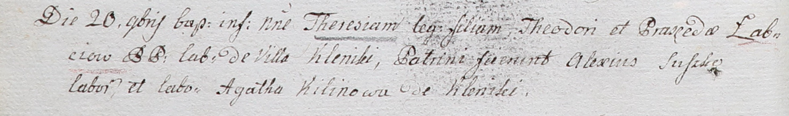

**Лапец Тодор (Łabec Theodor)**

20 ноября 1802 г -- крещение дочери Терезы (НИАБ 937-4-32, лист 7об,
№37/1802-р).

**НИАБ 937-4-32:** Лист 7об. **Метрическая запись №37/1802-р.**

{width="6.496527777777778in"
height="0.9611111111111111in"}

Дедиловичский костел Наисвятейшего Сердца Иисуса. 20 ноября 1802 года.
Метрическая запись о крещении.

Łabciowna Theresia -- дочь крестьян с деревни Клинники.

Łabiec Theodor -- отец.

Łabciowa Praxeda -- мать.

Suszko Alexius -- крестный отец, крестьянин.

Kilinowa Agatha -- крестная мать, крестьянка, с деревни Клинники.

Linhart Hyacinthus -- ксёндз.
