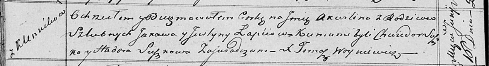

**Лапец Аквилина Яковова (Łapciowna Akwilina)**

16 июня 1818 г -- крещение (НИАБ 136-13-894, лист 98об, №18/1818-р
(ориг)).

**НИАБ 136-13-894:** Лист 98об. **Метрическая запись №18/1818-р
(ориг).**

Осовская Покровская церковь. 16 июня 1818 года. Метрическая запись о
крещении.

Łapciowna Akwilina -- дочь родителей с деревни Клинники.

Łapieć Jakaw -- отец.

Łapciowa Justyna -- мать.

Suszko Chwiedor -- кум.

Suszkowa Hadora -- кума.

Woyniewicz Tomasz -- ксёндз.
