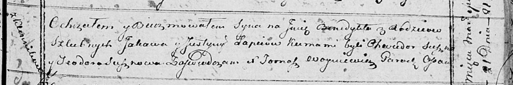

**Лапец Яков (Łapieć Jakow)**

4 мая 1813 г -- венчание с вдовой Юстыной Сушко с деревни Горелое (НИАБ
136-13-920, лист 19, №5/1813-б (ориг)).

21 марта 1815 г -- крещение сына Бенедыкта (НИАБ 136-13-894, лист 92,
№16/1815-р (ориг)).

16 июня 1818 г -- крещение дочери Аквилины (НИАБ 136-13-894, лист 98об,
№18/1818-р (ориг)).

**НИАБ 136-13-920:** Лист 19. **Метрическая запись №5/1813-б (ориг).**

Осовская Покровская церковь. 4 мая 1813 года. Запись о венчании.

Łapac Jakow -- жених, вдовец, с деревни Клинники.

Suszkowna Justyna -- невеста, вдова, с деревни Горелое.

Suszko Maxim -- свидетель.

Skłodoski Jakub -- свидетель.

Woyniewicz Tomasz -- ксёндз.

**НИАБ 136-13-894:** Лист 92. **Метрическая запись №16/1815-р (ориг).**

Осовская Покровская церковь. 21 марта 1815 года. Метрическая запись о
крещении.

Łapieć Benedykt -- сын родителей с деревни Клинники.

Łapieć Jakow -- отец.

Łapciowa Justyna -- мать.

Suszko Chwiedor -- кум.

Suszkowa Teodora -- кума.

Woyniewicz Tomasz -- ксёндз.

**НИАБ 136-13-894:** Лист 98об. **Метрическая запись №18/1818-р
(ориг).**

Осовская Покровская церковь. 16 июня 1818 года. Метрическая запись о
крещении.

Łapciowna Akwilina -- дочь родителей с деревни Клинники.

Łapieć Jakaw -- отец.

Łapciowa Justyna -- мать.

Suszko Chwiedor -- кум.

Suszkowa Hadora -- кума.

Woyniewicz Tomasz -- ксёндз.
