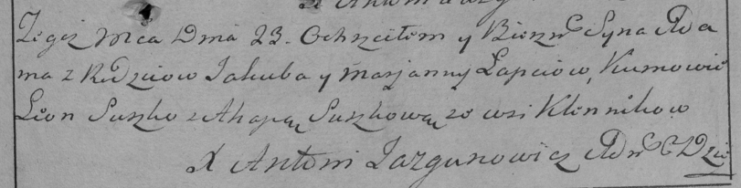

**Лапец Адам Якубов (Łapać Adam)**

23 декабря 1795 г -- крещение (НИАБ 136-13-894, лист 27, №63/1795-р
(ориг)), (РГИА 823-2-18, лист 254, №46/1795-р (коп)).

**НИАБ 136-13-894:** Лист 27. **Метрическая запись №63/1795-р (ориг).**

{width="6.496527777777778in"
height="0.9185925196850394in"}

Дедиловичская Покровская церковь. 23 декабря 1795 года. Метрическая
запись о крещении.

Łapać Adam -- сын родителей с деревни Клинники.

Łapać Jakub -- отец.

Łapciowa Marjana -- мать.

Suszko Leon - кум.

Suszkowa Ahapa - кума.

Jazgunowicz Antoni -- ксёндз.

**РГИА 823-2-18:** Лист 254. **Метрическая запись №46/1795-р (коп).**

{width="6.496527777777778in"
height="1.65in"}

Дедиловичская Покровская церковь. 23 декабря 1795 года. Метрическая
запись о крещении.

Łapiec Adam -- сын родителей с деревни Клинники.

Łapiec Jakub -- отец.

Łapciowa Marjanna -- мать.

Suszko Leon -- кум.

Suszkowa Ahapa -- кума.

Jazgunowicz Antoni -- ксёндз.
