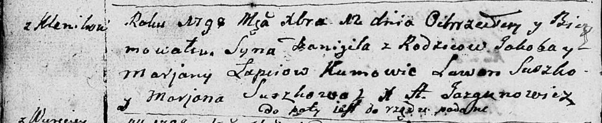
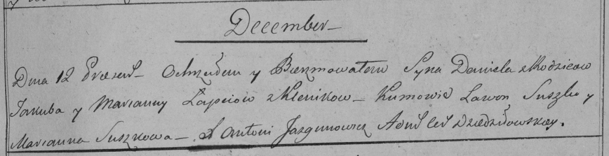

**Лапец Даниил Якубов (Łapać Danijił)**

12 декабря 1798 г -- крещение (НИАБ 136-13-894, лист 37об, №59/1798-р
(ориг)), (РГИА 823-2-18, лист 267, №60/1798-р (коп)).

**НИАБ 136-13-894:** Лист 37об. **Метрическая запись №59/1798-р
(ориг).**

Дедиловичская Покровская церковь. 12 декабря 1798 года. Метрическая
запись о крещении.

Łapać Danijił -- сын родителей с деревни Клинники.

Łapać Jakob -- отец.

Łapciowa Marjana -- мать.

Suszko Lawon - кум.

Suszkowa Marjana - кума.

Jazgunowicz Antoni -- ксёндз.

**РГИА 823-2-18:** Лист 267. **Метрическая запись №60/1798-р (коп).**

Дедиловичская Покровская церковь. 12 декабря 1798 года. Метрическая
запись о крещении.

Łapiec Daniel -- сын родителей с деревни Клинники.

Łapiec Jakub -- отец.

Łapciowa Marianna -- мать.

Suszko Lawon -- кум.

Suszkowa Marianna -- кума.

Jazgunowicz Antoni -- ксёндз.
