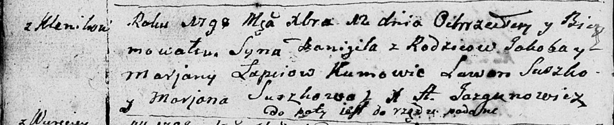

**Лапец (Моргун) Марьяна (Łapaciowa Marjana z Morhunow)**

27 октября 1795 г -- венчание с Якубом Лаптем с деревни Клинники (НИАБ
136-13-920, лист 2, №5/1795-б (ориг)).

23 декабря 1795 г -- крещение сына Адама (НИАБ 136-13-894, лист 27,
№63/1795-р (ориг)), (РГИА 823-2-18, лист 254, №46/1795-р (коп)).

12 декабря 1798 г -- крещение сына Даниила (НИАБ 136-13-894, лист 37об,
№59/1798-р (ориг)), (РГИА 823-2-18, лист 267, №60/1798-р (коп)).

23 октября 1799 г -- крестная мать Дымитрыя, сына Лапецов Давида и
Грыпины с Клинников (НИАБ 136-13-894, лист 40, №42/1799-р (ориг)).

11 января 1802 г -- крещение дочери Катерыны (НИАБ 136-13-894, лист 46,
№9/1802-р (ориг)).

31 января 1804 г -- крестная мать Марты, дочери Давида и Грыпины Лапецов
с деревни Клинники (НИАБ 937-4-32, лист 10, №3/1804-р).

**НИАБ 136-13-920:** Лист 2. **Метрическая запись №5/1795-б (ориг).**

Дедиловичская Покровская церковь. 27 октября 1795 года. Метрическая
запись о венчании.

Łapać Jakub -- жених, деревня Клинники.

Marhunowna Marjana -- невеста, деревня Клинники.

Suszko Mikołaj -- свидетель.

Szyło Jhnat -- свидетель.

Jazgunowicz Antoni -- ксёндз.

**НИАБ 136-13-894:** Лист 27. **Метрическая запись №63/1795-р (ориг).**

Дедиловичская Покровская церковь. 23 декабря 1795 года. Метрическая
запись о крещении.

Łapać Adam -- сын родителей с деревни Клинники.

Łapać Jakub -- отец.

Łapciowa Marjana -- мать.

Suszko Leon - кум.

Suszkowa Ahapa - кума.

Jazgunowicz Antoni -- ксёндз.

**РГИА 823-2-18:** Лист 254. **Метрическая запись №46/1795-р (коп).**

Дедиловичская Покровская церковь. 23 декабря 1795 года. Метрическая
запись о крещении.

Łapiec Adam -- сын родителей с деревни Клинники.

Łapiec Jakub -- отец.

Łapciowa Marjanna -- мать.

Suszko Leon -- кум.

Suszkowa Ahapa -- кума.

Jazgunowicz Antoni -- ксёндз.

**НИАБ 136-13-894:** Лист 37об. **Метрическая запись №59/1798-р
(ориг).**

Дедиловичская Покровская церковь. 12 декабря 1798 года. Метрическая
запись о крещении.

Łapać Danijił -- сын родителей с деревни Клинники.

Łapać Jakob -- отец.

Łapciowa Marjana -- мать.

Suszko Lawon - кум.

Suszkowa Marjana - кума.

Jazgunowicz Antoni -- ксёндз.

**РГИА 823-2-18:** Лист 267. **Метрическая запись №60/1798-р (коп).**

Дедиловичская Покровская церковь. 12 декабря 1798 года. Метрическая
запись о крещении.

Łapiec Daniel -- сын родителей с деревни Клинники.

Łapiec Jakub -- отец.

Łapciowa Marianna -- мать.

Suszko Lawon -- кум.

Suszkowa Marianna -- кума.

Jazgunowicz Antoni -- ксёндз.

**НИАБ 136-13-894:** Лист 40. **Метрическая запись №42/1799-р (ориг).**

Дедиловичская Покровская церковь. 23 октября 1799 года. Метрическая
запись о крещении.

Łapac Dymitry -- сын родителей с деревни Клинники.

Łapac Dawid -- отец.

Łapciowa Hrypina -- мать.

Bautruk Kondrat -- кум, с деревня Клинники.

Łapciowa Marjana -- кума, с деревня Клинники.

Jazgunowicz Antoni -- ксёндз.

**НИАБ 136-13-894:** Лист 46. **Метрическая запись №9/1802-р (ориг).**

Дедиловичская Покровская церковь. 11 января 1802 года. Метрическая
запись о крещении.

Łapciowna Katerzyna -- дочь родителей с деревни Клинники.

Łapać Jakob -- отец.

Łapciowa Marjana -- мать.

Suszko Leon -- кум.

Suszkowna Agata -- кума.

Lewicki Bruno -- ксёндз.

**НИАБ 937-4-32:** Лист 10. **Метрическая запись №3/1804-р.**

Дедиловичский костел Наисвятейшего Сердца Иисуса. 31 января 1804 года.
Метрическая запись о крещении.

Łapciowna Marta -- дочь родителей с деревни Клинники.

Łapiec Dawyd -- отец.

Łapciowa Hrypina -- мать.

Bautruk Kondrat -- крестный отец.

Łapciowa Maryanna -- крестная мать, с деревни Клинники.

Galinowski Joann -- ксёндз, комендант Дедиловичского костела.
